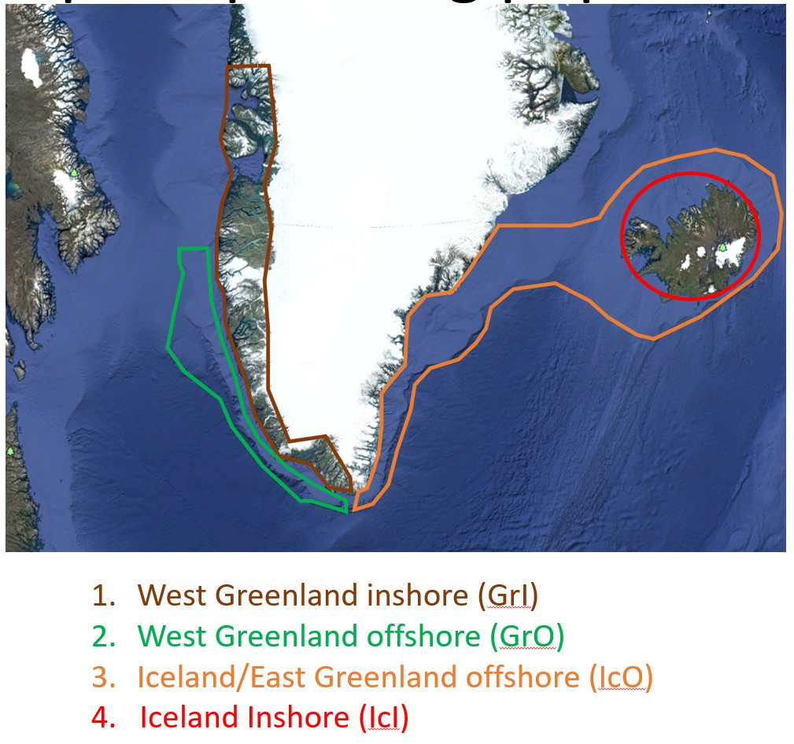

# Genetic methods in conservation and management of aquatic living resources. 
## Session: Data analysis
### Teachers: Belen Jimenez-Mena & Jakob Hemmer-Hansen
#### Date: Thursday 10/06/2021 and Friday 11/06/2021

## Schedule of the lecture:

The lecture will consist on the following two parts, each with a short introduction to the case study and a practical part:
- 2pm - 3pm: Species identification of filet DNA sequences (theory + practical)
- 8am - 10pm: Population genetics analysis I (theory + practical).
- 10.30am - 12: Population genetics analysis II (theory + practical)

The lecture is thought as a dynamic session - so discussions and questions are encouraged! :)

## Practical 1: Species identification of filet DNA sequences

You will use different softwares to identify the species belonging to your fish filet. 

First, check the sequences using a visualization tool. For example, how do they look? How are the beginning and end of the sequences?

Second, copy the sequence directly from the visualization tool and copy them into the barcode website. Do they match the species that was indicated in the filet's package?

## Practical 2: applying population genetic tools to a case study. 
For this part you require the use of the programming language R. Now you have all R, Rstudio and the packages needed for today's session installed in your laptop. If there is any problems installing R, see [here](installing_R) for a short manual on instructions how to set up R and Rstudio in your laptop.

### Data: The study of Cod in Greenland: Which population does the catches belong to?

We will use a SNP dataset of a cod study that our group carried out in 2013. You can read about the whole study in [Therkildsen et al. (2013)](https://onlinelibrary.wiley.com/doi/full/10.1111/eva.12055).
The individuals used for this study represent the baseline that we will be using for our analysis today. The data corresponds to the .gen file. The .gen format is a widely-used format in population genetics. The data can be found in Campusnet. 

### The objectives:

The objectives of today's session is:
* To recognize a file in the genetic format and identify its parts
* To define what a population is
* To apply different genetic tools in a real dataset
* To recognize different populations in a sample of different individuals, and quantify their differences
* To assign individuals back to their population of origin

## Case study

*MOTIVATION*

Based on studies like the one you read before, it is known that four different cod populations can be found in Iceland and Greenland: these are different spawning populations. These four populations are:
* West Greenland inshore (GrI)
* West Greenland offshore (GrO)
* Iceland/East Greenland offshore (IcO)
* Iceland Inshore (IcI)

Now, we want to know the origin of some samples obtained at a shop (your samples). Where do those samples come from, and which populations do they belong to?



## Data exploration

As a first step, it is always a good idea to explore how a genetic file looks like. Please, open the "baseline_data.gen" file and spend a few minutes exploring how the format is.
Pay special attention to:
* How are the alleles coded?
* Is there missing data? Is there a lot of it?
Discuss with your partner.

## Analysis

### R: the programming language for today

As mentioned, we are going to use the programming language R for the analysis and visualization. R is a programming language suited for statistical computing that has been developed by the scientific community and it is widely used for data analysis. 

OK. First, set up a folder in your computer where you will save the R script and the results generated in each of the exercises.
Now, we will open R, save the script into our folder. In R, appart from coding our own functions and programs, we can download packages and use the functions that have been developed and saved there. This is one of the advantages of using R, its active user community that helps us not re-invent the wheel.
So now we will load a few packages in R that contain the functions that we need. For that, write and run the following:
```
install.packages("<the package's name>")
```
R will then download the package from Internet. To load the package into your current session, you run:
```
library("<the package's name>")
```
or
```
require("<the package's name>")
```

### Packages needed for today's exercises

There are thousands of helpful R packages for you to use. For the analysis at this lecture, we will be using the following packages. If you work in the cluster, you don't have to install the packages, as they are already installed (you only need to load them using require(), but if you had to install them again, you just uncomment the install.packages() commands). If you work from your laptop, you'd need to install them if you don't have them yet.
```
require(adegenet)
require(diveRsity)
require(hierfstat)
require(rapport)
require(graph4lg)
library(dartR)
require(StAMPP)
require(HardyWeinberg)
require(genetics)
require(pegas)
```

### Loading the dataset

There are many ways to load a dataset in R. Because the file type is a gen file, we'll use one of the packages we just downloaded and loaded. To do this, we will introduce the path where you copied the dataset to your folder.
```
GP <- read.genepop("Baseline_file.gen",ncode = 3)
```

For the following analysis, we need to prepare the dataset a little bit. This means, for example, that we need to add the population name for each individual of the dataset and make it a factor. This is not really important right now (please, ask us if you want to know exactly what the following commands are doing). Otherwise, just type:
```
# include the pop map
GP_pop <- read.table("pop_map.txt",stringsAsFactors = F)
GP_pop <- as.data.frame(GP_pop)
GP_pop_fac <- as.factor(GP_pop$V2)
table(GP_pop_fac)
```

We will also convert it to a special format to analyse genomic datasets, a "genind" objects. As a first step we just have to type:
```
# convert into genepop file
gp <- genepop_to_genind("Baseline_file.gen", n.loci=96,allele.digit.coding = 3)
gp$pop <- GP_pop_fac
```
This will convert the dataset into the format we want and store it in an object called "data". You can use whatever name you want to store the data (with certain rules, e.g. no spaces in between words).


### First look

First, let's look how the data we just imported into R looks like. This is the first step when analysing a genomic dataset. Genomic datasets are quite large and therefore it is a bit difficult ("humanly impossible") to check each data row one by one, by hand. That's why we write scripts and use functions, so we can automate the checks and the analysis. It reduces errors (we are humans!) and assures reproducibility.

By typing the name where we store the dataset (see earlier commands),
```
GP
```
it will show us several lines of information, to summarize all the dataset. Basically we will be able to see a summary of what is inside "data". 
```
> GP
/// GENIND OBJECT /////////

 // 487 individuals; 96 loci; 192 alleles; size: 457.8 Kb

 // Basic content
   @tab:  487 x 192 matrix of allele counts
   @loc.n.all: number of alleles per locus (range: 2-2)
   @loc.fac: locus factor for the 192 columns of @tab
   @all.names: list of allele names for each locus
   @ploidy: ploidy of each individual  (range: 2-2)
   @type:  codom
   @call: read.genepop(file = "Baseline_file.gen", ncode = 3)

 // Optional content
   @pop: population of each individual (group size range: 62-215)
```
What does all this mean? The first row is telling us that the data file is a genlight object, and inside we can find 487 rows of genotypes (so 487 individuals genotyped for 96 loci, bi-allelic).
Please spend a few minutes familiarizing yourself with the information in each entry of the dataset. You can do that by using the command
```
head(GP@loc.fac)
```
The dataset we are working on consists on 487 individuals sampled from this 4 populations found in cod. 

### Calculating allele frequencies
We will again change the format of the file to calculate allele frequencies per population. You do the conversion here:
```
# convert to hierfstat
GP_hf <- genind2hierfstat(GP,pop=GP_pop_fac)
head(GP_hf[1:3,1:3])
```

And now, use the command below to calculate the allele frequencies per SNP, per population:
```
GP_stats <- basic.stats(GP_hf,diploid=TRUE,digits=4)
str(GP_stats$pop.freq)
```

Explore the dataset a little bit. You can save the table into your laptop if it is easier:
```
# Explore the dataset
#GP_stats$pop.freq
GP_stats$pop.freq[1:2]
write.table(GP_stats$pop.freq, "GP_stats")
```

Can you spot some differences already between the four populations?
For example, have a look at the following SNPs, which are called "Rhod_1_1", "HbBeta1_1", "Gm394_0364". You can access each of them by the following command:
```
GP_stats$pop.freq$Rhod_1_1
GP_stats$pop.freq$HbBeta1_1
GP_stats$pop.freq$Gm394_0364
```
Is there any population that has some of these locus fixed? Are there differences between the populations? Discuss with your partner.


### Filtering our dataset

As a second step in a population genetics/genomic analysis, we would need to filter the SNP-data. There are many ways of filtering a dataset, and it all depends what we are interested in. One thing to remember is that whatever we choose for filtering steps, we would need to report all the steps, so other scientists can replicate our analysis and understand why the results are the way they are. Some of the parameters that genomicists filter their data on is in the % of missing data, or minor allele frequencies. For the sake of simplicity, we won't be doing any filtering process for our exercises today, for two reasons: (1) the dataset has already been filtered (see the original article for details), and (2) for simplicity (one can spend lots of time in filtering - and one should!). Of course you are very welcome to try different filters at home.

### Hardy-Weinberg equilibrium
Next, let’s determine if our populations/loci are in Hardy-Weinberg equilibrium. Using the DartR package we will compute the χ2 statistic over the entire dataset and compute two P-values, one analytical and one derived from permutations:
First we will change the format again (to a genind object) and change a few things into the object in order the package to work.
```
gp_gi <- gi2gl(gp, verbose = NULL)
# And we need to add a metrics entry into the dataset, and convert it into a dataframe for it to work
genli_vcf<- gl.recalc.metrics(gp_gi)
genli_vcf$other$loc.metrics <- as.data.frame(genli_vcf$other$loc.metrics)
```
And now we can finally run the HWE test per locus. You can save the results into your folder if you want.
```
gg <- gl.report.hwe(genli_vcf, p = 0.05, subset = "each",bonf = TRUE)
#write.table(adeg_genind_noNA_hw, "HW_each.txt")
```

### Principal Component Analysis (PCA)

We will perform a principal component analysis (PCA) where we will visualize the population structure at an individual level. For the principal component analysis (PCA), we will use some functions that handles genomic objects very "quickly". 
```
adeg_pca <- scaleGen(gp, NA.method="mean",scale=F)
pca.adeg_pca <- dudi.pca(adeg_pca, scale=F, nf = 10,scannf = F)
s.class(pca.adeg_pca$li, fac=gp@pop, col=funky(15),cpoint=1)
s.class(pca.adeg_pca$li,fac=gp@pop,  xax=1, yax=2,
        col=transp(funky(12),.9),
        axesel=F, cstar=0,
        cpoint=2)
```

We can save the plot with this:
```
jpeg(filename = "PCA_cod.JPEG",
     width = 600, height = 600, units="px", pointsize=12, quality=300)
s.class(pca.adeg_pca$li,fac=gp@pop,  xax=1, yax=2,
        col=transp(funky(12),.9),
        axesel=F, cstar=0,
        cpoint=2)
dev.off()
```
How do you see the distribution of populations in the plot: 
* Do baseline samples represent different populations? 
* Are all populations clustered together in the same area, or some are further appart? 
* How many clusters do you see in the baseline file? 
Discuss in pairs.

Which loci seem to be driving the differenciation in the PCA? For looking into this, we can make a loading analysis. Select the first 5 axes.
```
deg_genind <- gi2gl(gp, parallel = TRUE)
pca_genlight <- glPca(deg_genind)
```
And now the loading plot:
```
loci_axis <- loadingplot(pca_genlight,axis = 1, lab.jitter = 1)
```
If we want to save the plot into your folder, you can simply run:
```
jpeg(filename = "cod_loadingPlot.JPEG",
     width = 600, height = 600, units="px", pointsize=12, quality=300)
loadingplot(pca_genlight,axis = 1, lab.jitter = 1)
dev.off()
```
At a first glance in your opinion, is there any special loci that seem to be driving the differentiation? 

### Degree of differentiation (Fst)

We will now have a look at the measure of genetic differentiation between the populations. We will measure this by calculating the Fst. For this, we'll make use of the package dartR. 
First, what would you expect to see? Remember that the Fst is a measure of how different a population is from another one.
When you are ready to check your expectations, you can type the following command lines to estimate Fst:
```
fst_test <- stamppFst(deg_genind, nboots = 10000, percent = 95)
fst_test$Fsts
fst_test$Pvalues
```
Are the results statistically significant? What genetic processes could have made that these populations are different from each other?

### Population structure analysis 

For this part, we will use another software, STRUCTURE, which is a popular software to look at population structure within populations. "Its uses include inferring the presence of distinct populations, assigning individuals to populations, studying hybrid zones, identifying migrants and admixed individuals, and estimating population allele frequencies in situations where many individuals are migrants or admixed. It can be applied to most of the commonly-used genetic markers, including SNPS" (see more information here in the website: https://web.stanford.edu/group/pritchardlab/structure.html)

## Practical 3: assigning new samples of cod to their populations of origin

After having explored the baseline, and seeing if they were different populations indeed, etc. we are ready to assign our new samples back to their populations of origin. For this, we will use the program GENECLASS which helps us doing this task.
The files we need to use are the baseline file we have been using "Baseline_file.gen", and a new one called "Unknown.gen".

